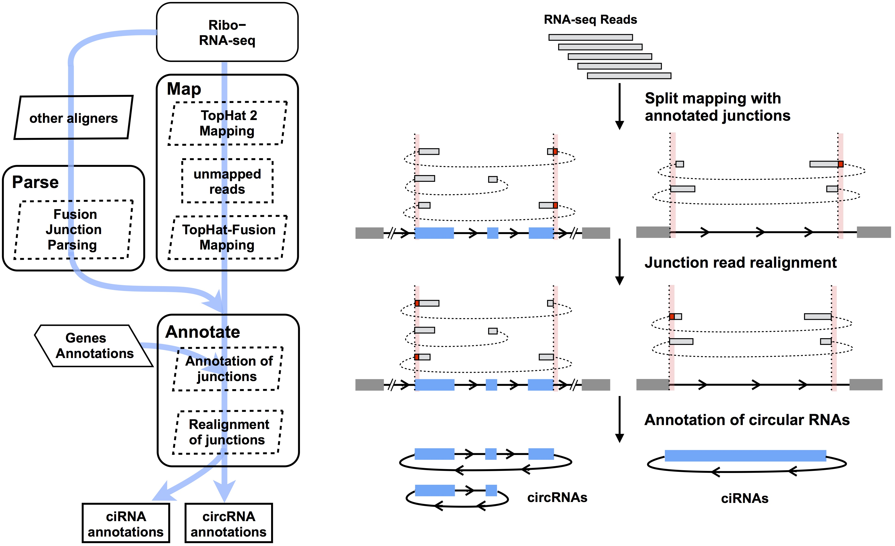

This pipeline is derived from [CIRCexplorer](http://yanglab.github.io/CIRCexplorer/) which was employed in our previous [Cell paper](http://www.sciencedirect.com/science/article/pii/S0092867414011118). It is a integrated strategy to identify junction reads from back spliced exons and intron lariats.

Features:

* It relies on existing gene annotations, and it only reports circular RNAs owning exactly the **same** boundaries with existing gene annotations. If you want to get circular RNAs with inaccurate boundaries, please see [Identify circRNAs without realignment]

It includes three steps:

* Fusion junction read mapping and parsing
* Fusion junction read annotating
* Fusion junction read realignment

Schematic Flow:

