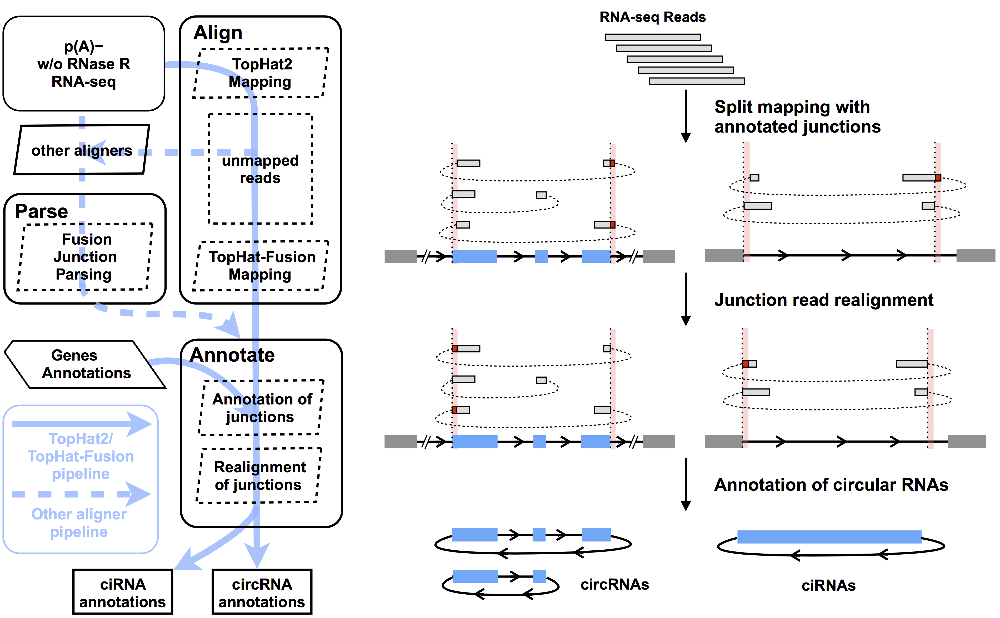
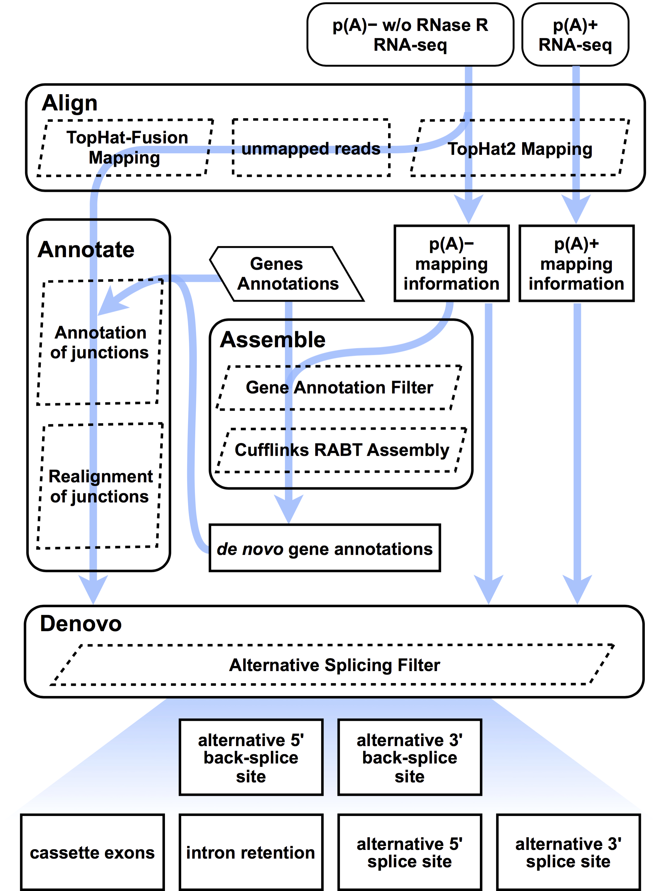

# Pipelines for Circular RNA Identification and Characterization

CIRCexplorer2 contains two main pipelines for circular RNA identification and characterization:

* Circular RNA annotating pipeline (annotating pipeline)
* Circular RNA characterization pipeline (characterization pipeline)

## Annotating pipeline

This pipeline is derived from [CIRCexplorer](http://yanglab.github.io/CIRCexplorer/) which was employed in our previous [Cell paper](http://www.sciencedirect.com/science/article/pii/S0092867414011118), and has been proven to be one of the most reliable bioinformatic tools for circRNA prediction ([Hansen, et al., *Nucleic Acids Res*, 2015](http://nar.oxfordjournals.org/content/early/2015/12/09/nar.gkv1458.full)). It is a integrated strategy to identify fusion junction reads from back spliced exons and intron lariats, and annotates these fusion junction reads to correct gene annotations with elaborately designed realignment script. In CIRCexplorer2, we extended this pipeline to support more aligners (including STAR, segemehl and MapSplice) for satisfying different requirements for circular RNA alignments and data mining.

### Schematic flow

### Features

* It relies on existing gene annotations, and it only reports circular RNAs owning exactly the same boundaries with existing gene annotations. This criterion enables this pipeline to have high accuracy in circular RNA prediction. If you want to identify circular RNAs with inaccurate boundaries, please see more information of [annotate module](../modules/annotate.md), but it may induce many false positives.
* It supports multiple aligners ([TopHat2](http://ccb.jhu.edu/software/tophat/index.shtml)/[TopHat-Fusion](http://ccb.jhu.edu/software/tophat/fusion_index.html), [STAR](https://github.com/alexdobin/STAR), [segemehl](http://www.bioinf.uni-leipzig.de/Software/segemehl) and [MapSplice](http://www.netlab.uky.edu/p/bioinfo/MapSplice2)).
* It is very convenient. You only need to run two simple commands to complete this pipeline without any additional manipulations, and CIRCexplorer2 would prepare all you need in following circular RNA analysis.
* It is sufficient for general circular RNA identification.

### Steps

* Circular RNA fusion junction read alignment ([Alignment](../tutorial/alignment.md)) and parsing ([Parsing](../tutorial/parsing.md))
* Circular RNA fusion junction read annotating and realignment ([Annotating](../tutorial/annotating.md))

### Results

Circular RNA infomation: `circularRNA_known.txt` or `circularRNA_full.txt`
See [Annotate](../modules/annotate.md) and [Denovo](../modules/denovo.md) for more details.

## Characterization pipeline

This pipeline aims to comprehensively and systematically characterize the landscape of alternative back-splicing and alternative splicing of circular RNAs through integrating de novo assembly for circular RNA transcripts.

### Schematic flow

### Features

* [Cufflinks](http://cole-trapnell-lab.github.io/cufflinks/) reference annotation based transcript ([RABT](http://bioinformatics.oxfordjournals.org/content/27/17/2325)) assembly method was employed to facilitate better identication novel transcripts for circular RNAs.
* Besides circular RNAs with annotated exons, it could identify hundreds of novel circular RNA specific exons, which are not expressed in linear RNAs.
* It could identify two types of alternative back-splicing events (alternative 5' back-splice site and alternative 3' back-splice site) and four types of alternative splicing events (cassette exon, intron retention, alternative 5' splice site and alternative 3' splice site).

### Steps

* Circular RNA fusion junction read alignment and parsing ([Alignment](../tutorial/alignment.md))
* De novo assembly for circular RNA transcripts ([Assembly](../tutorial/assembly.md))
* Characterization of alternative back-splicing and alternative splicing ([Alternative Splicing](../tutorial/as.md))

### Results

Novel circRNA infomation: `denovo/novel_circ.txt`  
Annotated circRNA infomation: `denovo/annotated_circ.txt`  
Alternative 5' back-splice site information: `abs/a5bs.txt`  
Alternative 3' back-splice site information: `abs/a5bs.txt`  
Cassette exon information: `as/all_exon_info.txt`  
Retained intron information: `as/all_intron_info.txt`  
Alternative 5' splice site information: `as/all_A5SS_info.txt`  
Alternative 3' splice site information: `as/all_A3SS_info.txt`  
See [Denovo](../modules/denovo.md) for more details of output files.
